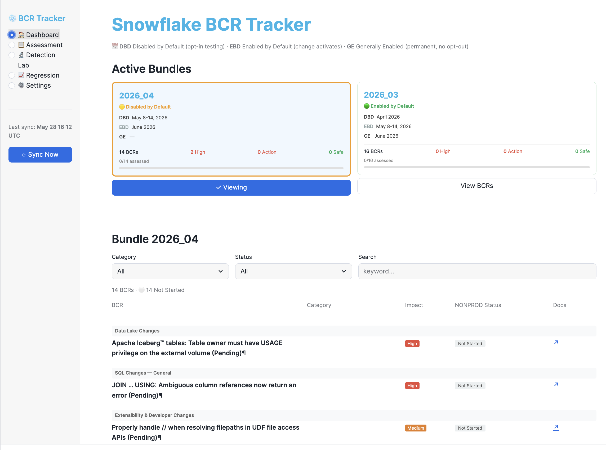
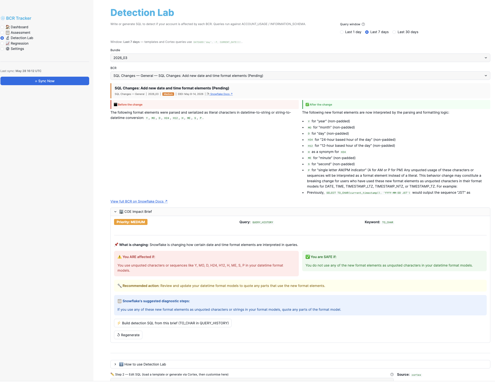
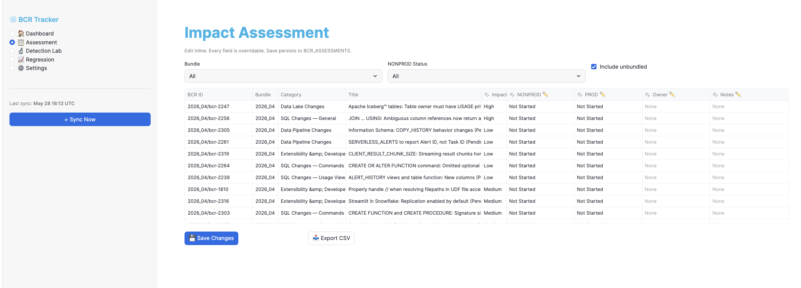

# Snowflake BCR Tracker

A **Streamlit in Snowflake** app that automatically tracks Snowflake Behavior Change Releases (BCRs) and helps your platform team assess, test, and sign off on upcoming changes before they enforce .

---

## Screenshots

### Dashboard — Bundle status, EBD countdown, assessment progress


### Detection Lab — Before/After from docs, COE Impact Brief, detection SQL


### Assessment — Editable tracking table with color-coded status


---

## What It Does

Snowflake releases BCR bundles quarterly. Each bundle contains changes that will eventually become permanently enforced. Without a structured process, teams discover breaking changes reactively — in production.

This app gives your platform COE a proactive workflow:

| Capability | How |
|---|---|
| Auto-discover active bundles | `SYSTEM$SHOW_ACTIVE_BEHAVIOR_CHANGE_BUNDLES()` — no manual config |
| Fetch BCR Before/After content | Snowflake docs `.md` pages — clean, structured, no HTML scraping |
| Assess impact per BCR | Editable table — NONPROD/PROD status, owner, notes, sign-off |
| COE Impact Brief | Cortex AI: plain English, affected-if, safe-if, recommended action |
| Detection Lab | Cortex generates `QUERY_HISTORY` detection SQL grounded in docs examples |
| Regression monitoring | Daily error rate tracking from `ACCOUNT_USAGE.QUERY_HISTORY` |
| Weekly auto-sync | Snowflake Task runs every Monday — zero ongoing maintenance |

---

## Prerequisites

| Requirement | Notes |
|---|---|
| Snowflake account | Business Critical or Enterprise edition |
| Role | `ACCOUNTADMIN` or a role with `CREATE DATABASE`, `CREATE INTEGRATION`, `CREATE TASK` |
| Warehouse | Any active warehouse (default: `COMPUTE_WH` — update at top of `setup.sql`) |
| Cortex AI | `SNOWFLAKE.CORTEX.COMPLETE` must be enabled in your account/region |
| External network access | Outbound HTTPS to `docs.snowflake.com` (standard on most accounts) |

> **Check Cortex availability first:**
> ```sql
> SELECT SNOWFLAKE.CORTEX.COMPLETE('mistral-large2', 'test');
> ```
> If this errors, Cortex is not enabled in your account — contact your Snowflake account team.

---

## Deploy in Snowsight (10 minutes)

### Step 1 — Run `setup.sql`

1. Open **`setup.sql`** in a Snowsight worksheet
2. Update the warehouse name at the top if needed:
   ```sql
   SET BCR_WH = 'COMPUTE_WH';  -- change to your warehouse name
   ```
3. Run the entire script

This creates the database, tables, stored procedures, scheduled tasks, and loads your first BCRs automatically.

**Verify with the query at the end of the script — expected output:**
```
BUNDLE_ID  BUNDLE_STATUS          BCR_COUNT  WITH_DESC
2026_04    Disabled by Default    14         14
2026_03    Enabled by Default     15         15
```

### Step 2 — Deploy the Streamlit App

1. Snowsight → **Projects → Streamlit → + Streamlit App**
2. Set database: `BCR_TRACKER_DB`, schema: `TRACKING`, warehouse: your warehouse
3. Select all in the editor → paste contents of **`streamlit_app.py`** → **Run**

The app loads immediately with live BCR data from your account.

---

## Run Locally (optional)

Useful for testing or iterating on the app without pasting into Snowsight each time.

```bash
cd bcr-tracker

python3 -m venv .venv
source .venv/bin/activate
pip install -r requirements.txt
```

Set `BCR_CONNECTION` to the name of your Snowflake connection in `~/.snowflake/connections.toml`:

```bash
BCR_CONNECTION=<your_connection_name> streamlit run streamlit_app.py
```

App opens at **http://localhost:8501**

> `requirements.txt` is only needed for local development — not required for Snowsight deployment.

---

## App Pages

| Page | What it does |
|---|---|
| **🏠 Dashboard** | Bundle status cards with EBD countdown, assessment progress bars, BCR list grouped by category with color-coded status. Urgent items surfaced at the top. |
| **📋 Assessment** | Editable table — set NONPROD/PROD status, owner, notes, case ID, risk acceptance for each BCR. |
| **🔬 Detection Lab** | Before/After from docs, Cortex COE Impact Brief, detection SQL editor with auto-fix on error, docs-grounded query suggestions. |
| **📈 Regression** | Live error rate chart from `ACCOUNT_USAGE.QUERY_HISTORY`. Anomaly detection (mean + 2σ). |
| **⚙️ Settings** | Sync bundles, load historical bundles, add unbundled changes, task status, danger zone. |

---

## Ongoing Operations

| Event | What happens | Action needed |
|---|---|---|
| New BCR bundle released | Weekly task auto-discovers and loads it (Mon 7am UTC) | None |
| Want to sync immediately | Sidebar **⟳ Sync Now** | Click once |
| Load a historical bundle | Not auto-loaded | Settings → Load Historical Bundle |
| Descriptions are empty | One-time backfill needed | Settings → Backfill Empty Descriptions |
| Update app code | Re-paste `streamlit_app.py` | Paste → Run in Snowsight editor |
| Update procedures | Re-run `setup.sql` | Safe to re-run — no data loss |

---

## Architecture

```
SYSTEM$SHOW_ACTIVE_BEHAVIOR_CHANGE_BUNDLES()
        │  SQL only — no HTTP
        ▼
FETCH_BCR_BUNDLE (Python stored procedure)
        │  docs.snowflake.com/...bcr-NNNN.md
        │  (.md URL → HTML fallback if 404)
        ▼
BCR_REGISTRY ──► BCR_ASSESSMENTS        (your team fills in)
             ──► BCR_DETECTION_QUERIES  (Cortex generates)
             ──► BCR_DETECTION_RESULTS  (run against ACCOUNT_USAGE)

ACCOUNT_USAGE.QUERY_HISTORY
        │
        ▼
BCR_REGRESSION_SNAPSHOTS  (nightly task)
```

---

## Files

| File | Purpose |
|---|---|
| `setup.sql` | Run once in Snowsight — creates all DB objects and loads initial data |
| `streamlit_app.py` | Paste into Snowsight Streamlit editor |
| `requirements.txt` | Local development only |

---

## Troubleshooting

**Sync returns `WARN: Parsed 0 BCRs`**
```sql
CALL BCR_TRACKER_DB.TRACKING.FETCH_BCR_BUNDLE('2026_03', 'Enabled by Default');
```
Check the return message — it includes a diagnostic snippet of what was fetched.

**Cortex errors in Detection Lab**
```sql
SELECT SNOWFLAKE.CORTEX.COMPLETE('mistral-large2', 'test');
```
If this fails, Cortex is not available in your account or region.

**External Access Integration fails**
```sql
SHOW EXTERNAL ACCESS INTEGRATIONS LIKE 'SNOWFLAKE_DOCS_ACCESS';
```
If missing, your role needs `CREATE INTEGRATION` privilege.

**Tasks not running**
```sql
SHOW TASKS IN SCHEMA BCR_TRACKER_DB.TRACKING;
ALTER TASK BCR_TRACKER_DB.TRACKING.BCR_WEEKLY_SYNC RESUME;
```
